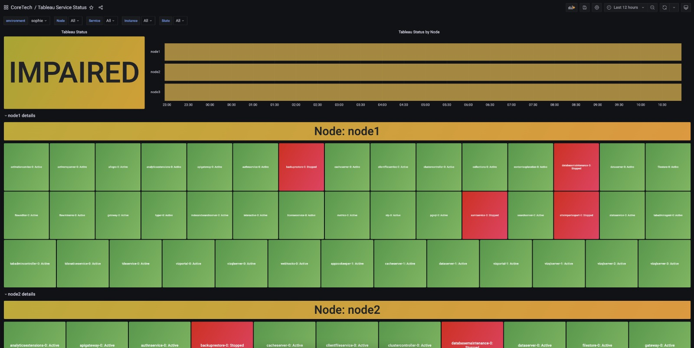

.. image:: https://static.pepy.tech/badge/tableau-prometheus-exporter
    :alt: Monthly Downloads
    :target: https://pepy.tech/project/tableau-prometheus-exporter

.. image:: https://img.shields.io/pypi/v/tableau-prometheus-exporter.svg
    :alt: PyPI-Server
    :target: https://pypi.org/project/tableau-prometheus-exporter/

.. image:: https://coveralls.io/repos/github/freenowtech/tableau-prometheus-exporter/badge.svg?branch=main
    :target: https://coveralls.io/github/freenowtech/tableau-prometheus-exporter?branch=main

.. image:: https://img.shields.io/badge/-PyScaffold-005CA0?logo=pyscaffold
    :alt: Project generated with PyScaffold
    :target: https://pyscaffold.org/

|

===========================
Tableau Prometheus Exporter
===========================

    Tableau Server Manager Prometheus Exporter

This repository contains the codebase to expose the Tableau Server Manager metrics to prometheus and visualize them in grafana.

---------------
Metrics Example
---------------

.. code-block::

    # HELP tableau_service_status Tableau services statuses
    # TYPE tableau_service_status gauge
    tableau_service_status{instance_id="0",node_id="node2",service_name="filestore",state="Enabled",status="Active"} 1.0
    tableau_service_status{instance_id="0",node_id="node2",service_name="authnservice",state="Enabled",status="Active"} 1.0
    tableau_service_status{instance_id="0",node_id="node2",service_name="databasemaintenance",state="Disabled",status="Stopped"} 0.0
    tableau_service_status{instance_id="0",node_id="node2",service_name="dataserver",state="Enabled",status="Active"} 1.0
    tableau_service_status{instance_id="1",node_id="node2",service_name="dataserver",state="Enabled",status="Active"} 1.0
    tableau_service_status{instance_id="0",node_id="node2",service_name="cacheserver",state="Enabled",status="Active"} 1.0
    tableau_service_status{instance_id="1",node_id="node2",service_name="cacheserver",state="Enabled",status="Active"} 1.0
    tableau_service_status{instance_id="0",node_id="node2",service_name="interactive",state="Enabled",status="Active"} 1.0
    tableau_service_status{instance_id="0",node_id="node2",service_name="searchserver",state="Enabled",status="Active"} 1.0
    tableau_service_status{instance_id="0",node_id="node2",service_name="statsservice",state="Enabled",status="Active"} 1.0
    tableau_service_status{instance_id="0",node_id="node2",service_name="vizportal",state="Enabled",status="Active"} 1.0
    tableau_service_status{instance_id="1",node_id="node2",service_name="vizportal",state="Enabled",status="Active"} 1.0
    tableau_service_status{instance_id="0",node_id="node2",service_name="backuprestore",state="Disabled",status="Stopped"} 0.0

--------------------
Install it from PyPI
--------------------

.. code-block:: bash

    $ pip install tableau-prometheus-exporter

-----
Usage
-----

**Python**

.. code-block:: python

    from tableau_prometheus_exporter.server import Server

    Server(config).start_and_run_forever()

**Command Line**

.. code-block:: bash

    $ python -m tableau_prometheus_exporter --h

**Docker**

.. code-block:: bash

    $ docker run --rm -p 8000:8000 -v ${PWD}/config.yaml:/app/config.yaml tableau-prometheus-exporter --config-file config.yaml

Go to http://localhost:8000/ to see the metrics.

-------------
Configuration
-------------

A sample configuration can be found at
`samples/config.yaml.template <https://github.com/freenowtech/tableau-prometheus-exporter/blob/main/samples/config.yaml.template>`_

---------
Dashboard
---------

A sample Grafana Dashboard can be found at
`samples/grafana.json <https://github.com/freenowtech/tableau-prometheus-exporter/blob/main/samples/grafana.json>`_

--------
Alerting
--------

A sample of prometheus alert can be found at
`samples/prometheus.yaml <https://github.com/freenowtech/tableau-prometheus-exporter/blob/main/samples/prometheus.yaml>`_

------------
Contributing
------------

Please refer to the `CONTRIBUTING <https://github.com/freenowtech/tableau-prometheus-exporter/blob/main/CONTRIBUTING.md>`_
file for information about how to get involved. We welcome issues, questions, and pull requests.

----
Note
----

This project has been set up using PyScaffold 4.5. For details and usage
information on PyScaffold see https://pyscaffold.org/.
